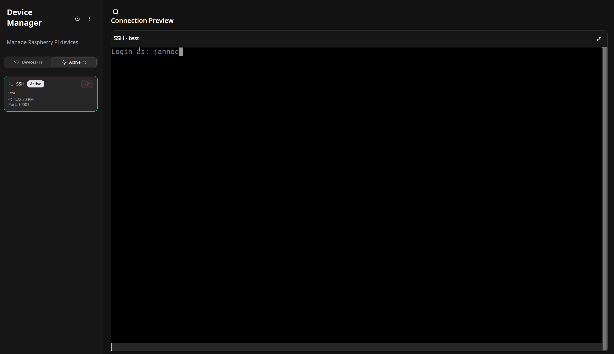

# Dockerized Pi/IoT Device Manager

This project provides a fully dockerized solution to remotely manage and access SSH-enabled IoT devices (e.g., Raspberry Pi) behind NAT. It leverages reverse SSH, a central server, and Apache Guacamole for secure, browser-based terminal access.

<!-- image from screenshots/screenshot.png -->



## Features

- **Secure reverse SSH**: Devices initiate outbound SSH tunnels to a public server.  
- **Web-based SSH access**: Integrated Guacamole UI allows SSH access directly from the browser.  
- **Dynamic device registration**: Devices send their public key to the server; access is approved centrally.  
- **On-demand tunnel creation**: Server manages port assignment and connection orchestration.  
- **Fully containerized**: Easily deployable with Docker Compose.

## Architecture Overview

```
Browser → Guacamole → Server → ssh-listener ← Reverse SSH ← Device
```

- `ssh-listener`: Accepts reverse SSH connections from registered devices. Shares SSH keys with the server.
- `server`: Manages device registration, SSH key authorization, and Guacamole tunnel creation via API.
- `guacamole`: Provides web UI for launching SSH connections to devices via reverse tunnel.

## How It Works

1. **Device Registration**:  
   The IoT device sends its public SSH key to the `server` upon registration.

2. **Authorization**:  
   The `server` pushes the authorized key into `ssh-listener`'s shared volume.

3. **Reverse SSH Tunnel**:  
   The device starts an SSH reverse tunnel to `ssh-listener`, binding a unique port (e.g., `10001`).

4. **Web Access via Guacamole**:  
   A Guacamole connection is dynamically created via API, and users can access the device shell directly from their browser.

## Getting Started

1. Clone repo
3. populate .env in server/backend/.env (use .env.example as example)
2. Run the stack:

   ```bash
   docker compose up --build
   ```

3. Run device-client on your remote device.
4. Access the device from your browser via `http://localhost:5000`.

## Use Cases

- Remote terminal access to Raspberry Pi or other edge devices
- Secure remote diagnostics behind NAT
- Centralized management for multiple devices
